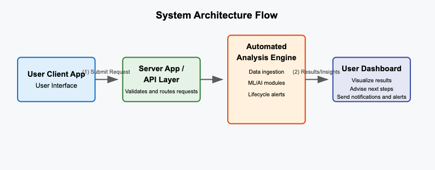

# Ainosha: AI-Powered Crypto Advisor

## Introduction

Ainosha is an AI-driven crypto advisory and asset management platform built to empower both beginners and seasoned traders. Our mission is to democratize advanced trading strategies by transforming user-defined intents into actionable insights—enabling automated, hands-off trading with dynamic risk management. Ainosha’s innovative approach leverages real-time market data, on-chain analytics, and AI-powered decision-making to streamline crypto investments.

---

## Table of Contents
1. [Project Overview](#project-overview)
2. [Problem Statement \& Market Opportunity](#problem-statement--market-opportunity)
3. [Solution Overview](#solution-overview)
4. [Technical Architecture](#technical-architecture)
5. [Comparisons \& Advantages](#comparisons--advantages)
6. [Roadmap \& Future Enhancements](#roadmap--future-enhancements)
7. [Team \& Partnerships](#team--partnerships)
8. [Alignment with Anoma’s Vision](#alignment-with-anomas-vision)
9. [Call to Action](#call-to-action)

## Project Overview
Ainosha Companion is designed to assist both **retail traders** and **professional investors** in making informed trading decisions. Our platform:
- **Collects** various data sources (market quotes, news, social sentiment).
- **Analyzes** them using automation workflows and ML/AI algorithms.
- **Generates** recommendations, real-time alerts, and educational content.
- **Guides** users on risk management and psychological aspects of trading.

**Goal**: To create a seamless “AI + human” collaboration that enhances decision-making and user confidence. We aim to constantly evolve our platform with new features and best practices.

---

## Problem Statement & Market Opportunity

### The Challenge:
- **Fragmented Tools:** Today’s crypto investors face a landscape where risk management, market analysis, and trade execution are scattered across multiple platforms.
- **Emotional Trading:** Manual trading often leads to decisions driven by emotion rather than data, resulting in missed opportunities or unnecessary losses.
- **Inefficient Risk Management:** Many platforms either over-simplify risk strategies or focus solely on one aspect (e.g., security alerts) without addressing comprehensive portfolio optimization.

### Our Opportunity:
- **Holistic Solution:** By uniting AI-powered analytics with automated trading and dynamic risk management, Ainosha provides a one-stop solution.
- **Intent-Centric Approach:** Our platform translates a trader’s strategic intents into precise actions, ensuring that each trade is aligned with personalized risk tolerance and market conditions.
- **Growing Demand:** With increasing market volatility and a surge in retail and professional crypto investors, there is a critical need for tools that can continuously monitor, analyze, and optimize investment decisions.

---

## Solution Overview

### Key Features:
- **AI-Powered Analytics:**
    - Continuously analyzes market trends, on-chain data, and social sentiment.
    - Provides instant trade recommendations tailored to current market dynamics.

- **Morning Notifications:**
    - **Personalized Daily Brief**: Each morning, users receive crucial market updates, relevant economic calendars, and potential watchlist moves.
    - **Optional Channels**: Deliver notifications via email, SMS, in-app messages, or chat apps like Slack/Telegram.

- **Detailed Trading Advice:**
    - **Lifecycle Guidance**:
      - *Before Trading*: Ainosha provides pre-market analytics and checks if upcoming news might affect your watchlist.
      - *During Trading*: Real-time monitoring of positions, alerts if volatility spikes, or if stop-loss thresholds are breached.
      - *After Trading*: Post-trade analytics, performance breakdown, and suggestions for improvement.
    - **Risk Status Checks**: Highlights if a trade is high-risk (due to volatility or negative sentiment) or low-risk (stable trends, solid fundamentals).

- **Portfolio Optimization:**  
    - **Dynamic Rebalancing**: Automatically adjusts portfolio allocations based on market conditions and user-defined risk profiles.
    - **Performance Tracking**: Real-time monitoring of portfolio health, with detailed reports on gains, losses, and risk exposure.

- **Risk Management:**
    - Integrates comprehensive risk controls to ensure investments are aligned with individual risk profiles.
    - Monitors portfolio performance in real time and adjusts allocations based on market conditions.

- **Seamless API Integrations:**
    - Securely connects with major cryptocurrency exchanges to enable smooth data flow and trade execution.
    - Provides an intuitive dashboard for users to manage their assets and review performance reports.
    - Provide sdk integration for users to build their own trading strategies.

- **Automated Trading & Portfolio Optimization:**
    - Offers both fully automated trade execution and manual trade signals.
    - Features dynamic stop-loss and take-profit settings to protect gains and minimize losses.

### How It Works:
1. **Client App**
    - Captures user requests (e.g., “What’s the risk of stock ABC?”).
    - Provides an intuitive interface with natural language input, if possible.

2. **Server App**
    - Coordinates incoming requests.
    - Might use microservices for data retrieval (market data, news APIs), NLP interpretation, and risk engine calls.

3. **Automated Analysis Engine**
    - **Data Ingestion**: Streams real-time data (prices, volume, news, social sentiment) into an internal data store.
    - **ML/AI Models**: Predictive algorithms evaluate potential trade opportunities, risk levels, or forecast price trends.
    - **Risk Framework**: Integrates rule-based checks (position sizing, stop-loss rules) and advanced calculations (Value-at-Risk, sentiment shifts).
    - **Alerting & Insights**: Generates personalized advisories—morning digest, mid-trade signals, and post-trade summaries.

4. **Output/Feedback**
    - Results display on the user’s dashboard or client app.
    - Optional push notifications to keep users engaged and informed around the clock.

This **modular structure** ensures scalability, easier maintenance, and the flexibility to adopt new models or data sources in the future.

---

## Technical Architecture

### System Overview:

## Comparisons & Advantages
Below is a brief comparison of Ainosha against other AI agent analytics platforms. For a detailed breakdown, see the [research notes](#) (coming soon).

| Aspect                   | Ainosha (Current)                                           | Other AI Agents (Reference)                          |
|--------------------------|-------------------------------------------------------------|------------------------------------------------------|
| **User Input**           | Client app + server-side logic                              | Multi-channel interface, possibly NLP chat/voice     |
| **Data Analysis**        | Automated workflow, potential for ML/AI integration         | Advanced algorithms with real-time streams           |
| **Risk Management**      | Basic checks and notifications                              | Robust risk modeling with emotional bias alerts      |
| **Alerts/Notifications** | Morning briefs + in-trade alerts                            | Real-time notifications via multiple channels        |
| **Credibility**          | Building through small pilot tests & team expertise         | Established track record, known domain experts       |
| **Roadmap**              | Transitioning from rule-based to more advanced ML methods   | Already heavily reliant on machine learning at scale |

**Takeaway**: By expanding real-time data integration, adopting advanced ML, and emphasizing risk checks, Ainosha can become on par with well-established AI analytics platforms.

---

## Roadmap & Future Enhancements

### Phase 1: Foundational MVP
- Launch the basic platform with user onboarding, initial AI analytics, and a simplified dashboard.
- Implement multi-channel morning briefs and trade lifecycle alerts.
- Implement primary exchange API integrations and basic risk management features.

### Phase 2: Core Feature Expansion
- Roll out advanced AI advisory functionalities and enhanced portfolio optimization.
- Introduce a subscription model and expand API integrations to support additional exchanges.
- Upgrade risk management features to include dynamic stop-loss and take-profit automation.
- Introduce predictive algorithms for price forecasting and anomaly detection.

### Phase 3: Ecosystem Integration & Scale-Up
- Develop next-generation AI models to further refine trading signals.
- Provide side-by-side performance metrics of AI vs. user decisions.
- Explore partnerships with institutional investors and integrate with emerging DeFi ecosystems.
- Prepare for deeper integration with the Anoma intents ecosystem to leverage intent-centric infrastructure.

---

## Team & Partnerships

### Our Team:
- **Tony Le – Founder & Lead Developer:**  
  Experienced in backend development with a strong passion for crypto and AI.
  Backgrounds in **PHP, Python, Node.js**, and containerized deployment (Docker, AWS).
- **Hiep Nguyen – Co-founder & Senior Fullstack Developer:**  
  Skilled in frontend development and UI/UX design, with a focus on user-centric platforms.
- **Davele – Core Advisor:**  
  Focused on strategic partnerships and business development.

### Strategic Partnerships:
- We are actively seeking partnerships with leading crypto exchanges, risk management firms, and blockchain infrastructure providers.
- Our advisors include industry experts with a track record of successful blockchain and AI ventures.

---

## Alignment with Anoma’s Vision

Ainosha aspires to be an “intent-centric” AI application, which resonates with [Anoma’s vision](https://anoma.net/blog/introducing-intents-initiates#who-should-apply). Here are key steps toward alignment:

1. **User Intents**: Model each user request as an *intent*—“Analyze this asset,” “Monitor my portfolio risk.” A decentralized execution framework can then fulfill these intents securely.

2. **Privacy & Data Sovereignty**: Implement robust encryption and consider privacy-preserving techniques so users retain control over sensitive financial data.

3. **Decentralized Architecture**:
    - Explore running modules on a blockchain or using decentralized oracles for market data.
    - Potentially incorporate zero-knowledge proofs or other privacy solutions so analytics can run trustlessly.

4. **Open Source Collaboration**: Anoma welcomes collaborative projects. By **open-sourcing** components of Ainosha, the community can contribute new data connectors, ML modules, or risk models.

---

## Call to Action

Are you ready to transform the way you invest in crypto?  
Visit our https://ainosha.com/ or check out our [GitHub Repository](#https://github.com/ainosha-ai/ainosha-companion-platform) to explore our code, provide feedback, or even contribute.  
For further inquiries or to schedule a demo, please contact us at [contact](mailto:ainoshaai@gmail.com).

Join us on our journey to revolutionize crypto trading through intent-centric technology!

---

© 2025 Ainosha. All rights reserved.
